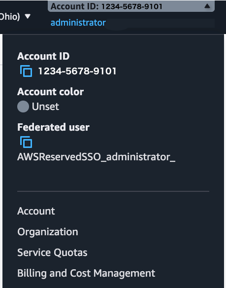
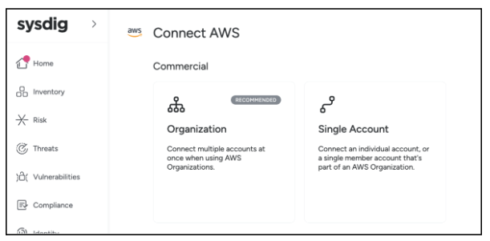

--
title: 'AWS Onboarding'
description: 'This topic describes how to connect your AWS environment to Sysdig Secure. You can connect Single Accounts or entire Organization Accounts using Terraform or CloudFormation.'
---


# AWS: Connect to Sysdig
*(Original: https://docs.sysdig.com/en/sysdig-secure/connect-aws/)*

This topic describes how to connect your AWS environment to Sysdig Secure. You can connect Single Accounts or entire Organization Accounts using Terraform or CloudFormation.

## 1. Prerequisites

- A **Sysdig Secure administrator** account.
- An **AWS user or role** with permission to install [IAM policies](https://docs.aws.amazon.com/IAM/latest/UserGuide/id.html), as shown in the table below.
- A local workstation with **Terraform v1.5+** installed or access to **CloudFormation**.

<details>
<summary>Click to Learn More About Using Terraform</summary>

  - For Terraform, use the command line to export your AWS keys, or see the [AWS Terraform Provider documentation](https://registry.terraform.io/providers/hashicorp/aws/latest/docs#authentication-and-configuration) for other ways to authenticate.

```
    $ export AWS_ACCESS_KEY_ID="anaccesskey"
    $ export AWS_SECRET_ACCESS_KEY="asecretkey"
    $ export AWS_REGION="us-east-1"
```

If you're using [AWS CLI](https://aws.amazon.com/cli/), edit the `/home/user/.aws/credentials` file:
```
[default]
aws_access_key_id=anaccesskey
aws_secret_access_key=asecretkey
aws_session_token=atokenkey   # Sometimes necessary for orgranizations using SSO
```
You can also set your default AWS region in `/home/user/.aws/config` by adding:
```
[default]
region = us-east-1      # Set to your region
```

Check your workstation's connection and authentication with AWS with this command:
```
$ aws sts get-caller-identity
```
</details>


<details>
<summary>Click to Learn More About IAM Permissions</summary>
<table>
    <tr>
        <td align="center" colspan="2"><b>Single Account Installations Policy</b></td>
    </tr>
    <tr>
        <td><a href="https://docs.aws.amazon.com/aws-managed-policy/latest/reference/IAMFullAccess.html">IAMFullAccess</a></td>
        <td>Required to create IAM Roles and associated permissions.</td>
    </tr>
    <tr>
        <td align="center" colspan="2"><b>Organization installations Policies</b></td>
    </tr>
    <tr>
        <td><a href="https://docs.aws.amazon.com/aws-managed-policy/latest/reference/IAMFullAccess.html">IAMFullAccess</a></td>
        <td>Required to create IAM Roles and associated permissions.</td>
    </tr>
    <tr>
        <td><a href="https://docs.aws.amazon.com/aws-managed-policy/latest/reference/AWSOrganizationsReadOnlyAccess.html">AWSOrganizationsReadOnlyAccess</a></td>
        <td>Required to list Accounts and OUIDs in your Organization.</td>
    </tr>
    <tr>
        <td><a href="https://docs.aws.amazon.com/aws-managed-policy/latest/reference/AWSCloudFormationFullAccess.html">AWSCloudFormationFullAccess</a></td>
        <td>Required to create a CloudFormation StackSet that creates IAM roles in each Account in your Organization.</td>
    </tr>
</table>
</details>


## 2. Collect Your Account Details
<div style="float: right; padding: 10px;">
    
</div>

- Sign in to the **AWS Console**. For an **Organization**, ensure you sign in to your organization's management account.
- Expand the dropdown in the top right corner of the **AWS Console** and copy your **Account ID**.
- *Optional Organization Unit IDs.* By default, your entire AWS Organization will be onboarded. If you want to restrict onboarding to a subset of your Organization, you can gather specific OUIDs now and enter them in the following steps.


## 3. Connect with Terraform

<div style="float: right; padding: 10px;">
    
</div>

- Log in to **Sysdig Secure**.
- Click **Integrations** at the bottom of the main left-hand navigation menu, and choose **AWS Cloud Accounts**.
- Choose whether to connect an AWS **Organization** or a **Single Account**.
- For **Organization** accounts, In Step 2, enter your **AWS management Account ID** and select your **Primary Region**. For **Single Accounts**, enter only your **AWS Account ID**.
- In Step 3, you can onboard a subset of your Organization Accounts by entering the OUIDs in a comma-separated list. Leave the field blank to onboard your entire Organization.
- In Step 4, click the **Next** button to generate a `main.tf` file to use with Terraform. Copy its contents and paste them into a new file, or download the file to an empty folder on your workstation, such as `/home/user/sysdig_onboarding`.
- On your **workstation**, navigate using the CLI to the folder containing your main.tf file and execute the following commands:

```
$ cd /home/user/sysdig_onboarding   # Your main.tf file location
$ terraform init && terraform apply
```

- When Terraform completes, click the **Complete Onboarding** button in the Sysdig Secure dashboard. Your newly added account will appear in the **Cloud Accounts** page.

## 4. Connect with CloudFormation
- Log in to **Sysdig Secure**.
- In a separate browser window, log in to your **AWS Account**. For Organization installs, be sure to log into your Organization's Management Account.
- For **Organization** accounts, in Step 2, enter your **AWS management account ID** and your OUID(s). For a **Single Account**, enter only your **AWS Account ID**.
- In Step 3, click the **Launch Stack** button. This will shift you to an **AWS console** browser window. Follow any prompts in AWS to deploy the required resources, and be sure to check the Acknowledgements in the AWS Capabilities section.
- When CloudFormation completes, click the **Complete Onboarding** button in the Sysdig dashboard. Your newly added account will appear in the Cloud Accounts page.

## 5. Check the Connection
- To validate your AWS connection, navigate to Sysdig Secure's **Integrations** > **Environments** > **AWS**.
- Click the **Added On** column heading to show the most recently added account on top.
- The **Status** column shows the overall connection status:
  - Connected
  - Error
  - Needs Attention
  - Unknown

Select the desired AWS account to review the individual services in the detail drawer. There you can view the status of each feature you've enabled. 

<details>
<summary>See an Example of the Health Status for CSPM</summary>

| **CSPM Status** | **Description**                                                  |
|-----------------|-----------------------------------------------------------------------|
| ✅ **Healthy**  | The account has been successfully connected, and all the resources have been scanned.|
| **! Needs Attention** | Some features are not working properly.|
| ❌ **Error** | Authentication errors. For example: <ul><li>Invalid account ID</li><li>Invalid client secret</li><li>Invalid access credentials</li><li>Access token errors</li><li>Deny policy created by the user is preventing Sysdig from collecting resources</li><li>The scan takes too long and eventually times out.</li><li>Unknown error</li></ul>|
</details>

## Further Reading

<details>
<summary>Learn More About Permissions</summary>

### Permissions Granted to Sysdig
The above installation creates two IAM Roles that Sysdig can access. These Roles have the following permissions:

- A role named `sysdig-secure-onboarding-XXXX`, used to manage the base integration with Sysdig
  - AWSAccountManagementReadOnlyAccess
  - AWSOrganizationsReadOnlyAccess (Organizational install) 
- A role named `sysdig-secure-posture-XXXX`,used to collect an inventory of cloud resources and perform CSPM
  - SecurityAudit
  - A Custom IAM Policy containing the following permissions:
    - `account:GetContactInformation`
    - `elasticfilesystem:DescribeAccessPoints`
    - `lambda:GetFunction`
    - `lambda:GetRuntimeManagementConfig`
    - `macie2:ListClassificationJobs`
    - `waf-regional:ListRuleGroups`
    - `waf-regional:ListRules`
    - `bedrock:ListAgents`
    - `bedrock:GetAgent`
    - `bedrock:ListKnowledgeBases`
    - `bedrock:GetKnowledgeBase`
    - `bedrock:ListGuardrails`
    - `bedrock:GetGuardrail`
    - `bedrock:GetModelInvocationLoggingConfiguration`
</details>


<details>
<summary>Learn More About Identies Shared with Sysdig</summary>

### Identities
Two [AWS identities](https://docs.aws.amazon.com/IAM/latest/UserGuide/id.html) are required in the onboarding process:
- *Installer*: Either an AWS user or a role used to perform the onboarding. Sysdig does not have access to this identity.
- *Sysdig*: A set of IAM Roles created during onboarding with specific, less permissive permissions attached. Sysdig is given access to these roles.
</details>